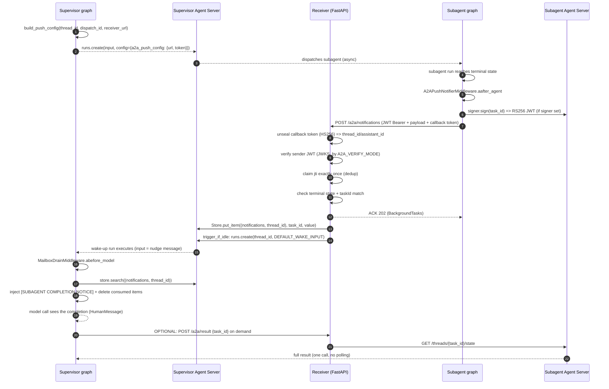
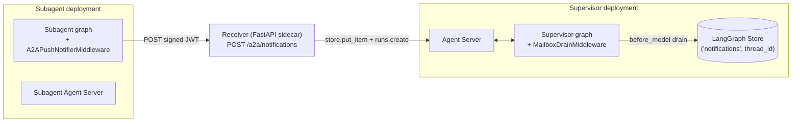
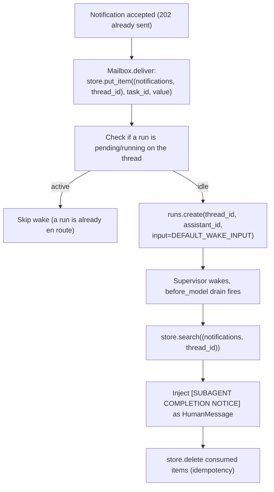

# a2a_completion_notifier — troubleshooting & internals

> **Want the "make it just work" version?** See the
> [main overview](a2a_completion_notifier.md) page.  Want the operational
> reference (packaging, `A2A_VERIFY_MODE`, env vars, API)?  See the
> [customization](a2a_completion_notifier_reference.md) page.  This page is for
> support/debugging: what happens inside the bite, in what order, and how to see
> it failing.

## Lifecycle at a glance

This is the whole journey of one completion notification, from the moment a
supervisor dispatches work to the moment its model sees the subagent finished.



## Deployment shape

The receiver runs as a standalone FastAPI sidecar (`create_receiver_app`), an
always-on process you own next to the supervisor:



## Store + drain mechanics

The delivery pipeline is *write-first, then wake*. Ordering matters:



- **Write-first.** The completion is written to the Store *before* the wake
  check. A check-then-create race therefore resolves to a harmless extra empty
  run instead of a lost notification.
- **`DEFAULT_WAKE_INPUT`.** The wake run must carry a real message. A run with
  `input=None` is a silent no-op on an idle thread in some Agent Server versions
  (no node executes, so the `before_model` drain never fires). The wake message
  only makes the run execute; the drain injects the real notice. The
  supervisor-side prompt that governs how drained notices are handled is
  separate: it keys off the injected notice, not this wake text (see the main
  overview, Step 3).
- **`multitask_strategy="enqueue"`.** The only option that does not drop a queued
  wake. Never pass a strategy that would discard the wake run.
- **Idempotent drain.** Notices are deleted *after* they are injected into the
  returned state update. A superstep retry re-drains an already-empty Store
  instead of double-injecting.
- **The namespace.** `("notifications", thread_id)` is a per-thread area keyed by
  `task_id` (Store key), so a redelivery overwrites instead of appending.
- **`jti` dedup.** A2A is at-least-once. The receiver claims the JWT `jti` exactly
  once (Redis `SET NX EX`) so a retried webhook collapses to a no-op. The TTL must
  exceed the sender's total retry window (900s default covers most policies).


## Module topology

Which module owns which concern. A support person debugging "why did the
supervisor not learn the subagent finished" starts here.

| Concern | Module | Public symbols |
|---|---|---|
| Emit the webhook (subagent side) | `middleware.py` | `A2APushNotifierMiddleware`, `build_a2a_notifier_from_config`, `extract_push_config`, `PushNotificationConfig` |
| Sign the JWT / publish JWKS | `signer.py` | `A2ASigner` |
| Deliver the webhook with retry/backoff | `push_client.py` | `PushClient`, `PushClientSettings` |
| Mint the dispatch config (supervisor side) | `push_config.py` | `build_push_config` |
| Terminate the webhook (FastAPI) | `receiver.py` | `create_receiver_app`, `process_notification`, `process_task_result` |
| Verify sender JWT / fetch JWKS | `auth.py` | `verify_sender_jwt`, `JWKSClient`, `SenderAuthError` family |
| Dedup by `jti` | `idempotency.py` | `RedisJtiStore`, `InMemoryJtiStore`, `JtiStore` |
| Mailbox write + wake | `mailbox.py` | `NotificationMailbox`, `MailboxWriteError`, `MailboxWakeError`, `DEFAULT_WAKE_INPUT` |
| Drain into the model call | `drain.py` | `MailboxDrainMiddleware`, `MailboxDrainError`, `render_notice` |
| Fetch the full result on demand | `result_fetch.py` | `fetch_task_result`, `ResultFetchSettings`, `TaskResultError` |
| Wire format (shared) | `payload.py` | `build_notification`, `extract_callback_token`, `extract_terminal_state`, `TERMINAL_STATES` |
| Opaque callback token | `tokens.py` | `mint_callback_token`, `unseal_callback_token`, `CallbackToken` |
| Config + security modes | `settings.py` | `ReceiverSettings`, `EmitterSettings`, `A2AVerifyMode` |

## Failure modes & troubleshooting

What can fail, how you would see it, and where to look.

| Failure | Surface | What to check |
|---|---|---|
| Wake-up run create fails | `MailboxWakeError` (raised), log `a2a_wake_create_failed` | Is the supervisor Agent Server up? Is `assistant_id` valid? Store may hold the notice but the supervisor never woke. |
| Store `put_item` fails | `MailboxWriteError` (raised), log `a2a_forward_failed` | Store up? Namespace valid? The sender may retry (at-least-once). |
| Store search fails during drain | `MailboxDrainError` (raised), log `a2a_drain_search_failed` | Store connectivity; pending completions are **not** dropped silently. |
| Delete-failure after drain | log `a2a_drain_delete_failed` (error) | Notice is still injected; a superstep retry re-drains (possible double-render). Watch for unbounded notice growth. |
| Notification build/sign fails | `PushEmissionError` (raised), log `a2a_emit_build_failed` | Is the signer configured? Is the task id resolvable from `execution_info`? |
| Webhook POST fails (retries exhausted) | log `a2a_push_failed` (returns `False`), logged per-attempt `a2a_push_retry` | Receiver URL reachable? Retry/backoff budget too small? |
| Sender JWT bad / missing | HTTP 401, `SenderAuthError` → `a2a_mode_*` logs | JWKS URL, `kid`, `iss`/`aud` pinning, `iat` staleness window. |
| Callback token invalid/expired | HTTP 400 | `A2A_CALLBACK_TOKEN_SECRET` mismatch, token TTL. |
| JWKS/issuer fetch fails | HTTP 502, `a2a_*` key-fetch error | Subagent JWKS endpoint reachable? |
| Duplicate delivery | HTTP `{"status": "duplicate"}`, no re-delivery | `jti` TTL vs sender retry window. |
| Dev-server drain | `MailboxDrainMiddleware` falls back to a langgraph-sdk HTTP `StoreClient` (`A2A_SUPERVISOR_URL`) when `runtime.store` is absent (`langgraph dev`) | `A2A_SUPERVISOR_URL` reachable? The same mailbox is read/consumed over HTTP. |

> **Delivery failures are log-only today.**  The receiver surfaces
> `a2a_forward_failed` / `a2a_forward_wake_failed` at error level but does
> **not** park the notification anywhere for later inspection.  Alert on
> those two log events as the undelivered-completion signal.

## Reading the logs

The bite logs structlog events. A healthy happy path (unsigned, `dev` mode) looks
like:

```
a2a_push_retry       (subagent trying the webhook, attempt N)
a2a_dev_ignores_sender_jwt   (receiver, dev mode, unsigned accepted)
a2a_mailbox_write    (receiver wrote the completion to the Store)
a2a_wake_triggered   (receiver created the wake-up run)
a2a_drained          (supervisor injected N notices into the model call)
```

Error-level events worth alerting on: `a2a_push_failed`, `a2a_forward_failed`,
`a2a_forward_wake_failed`, `a2a_drain_search_failed`, `a2a_emit_build_failed`,
`a2a_wake_create_failed`.

## Ecosystem caveats

- **The `-32601` gap.** LangChain's Agent Server does not implement the A2A push
  operations today, so this bite supplies the missing side. Nothing here depends
  on a future protocol change; if the ecosystem adds push delivery, the
  plumbing that made sense today (write to Store + wake) may converge to a
  different shape.
- **Dev-server parity.** The `langgraph dev` in-memory runtime does not expose
  `runtime.store` on middlewares, so `MailboxDrainMiddleware` falls back to a
  langgraph-sdk HTTP `StoreClient` (built from `A2A_SUPERVISOR_URL`) and drains
  the same mailbox over HTTP.  No separate drain is needed.  The platform /
  Agent Server (Postgres) runtime supplies `runtime.store` directly and is used
  unchanged.


