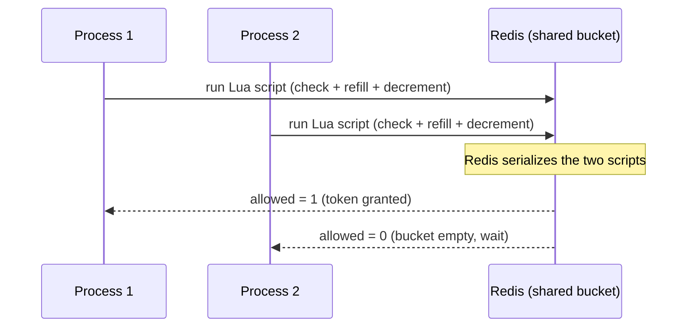
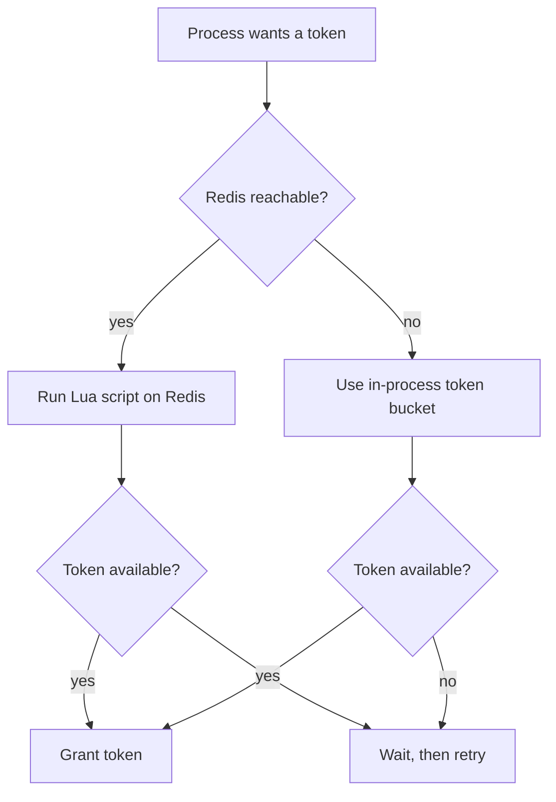

# api_rate_limiter

Distributed rate limiting for external API calls made by LangGraph subagents.

## The problem

Your agents call external APIs. When you scale out, you run into a limit that a single-process limiter cannot handle.

A per-process semaphore gives each process its own budget. If you run three replicas, your effective rate limit becomes the configured limit times three. You exceed the provider's cap and get throttled, even though each process thinks it is behaving.

The same thing happens with [`Send`](https://docs.langchain.com/oss/python/langgraph/reference/types#langgraph.types.Send) fan-out. When one superstep dispatches many parallel subagents, they all call the same API at once. A per-process limit does not coordinate them.

## How this bite helps

It keeps the token bucket state in Redis, shared across every process, and updates it atomically with a Lua script. Callers across different workers never race on read-modify-write. If Redis is unreachable, it falls back to an in-process token bucket so rate limiting still works per process and the system stays up (just without cross-replica coordination).

## Rate limiting options

The algorithm is a token bucket: each provider is configured with a `capacity` (max burst, how many requests can fire at once) and a `refill_rate` (tokens added per second). This matches how providers phrase their limits ("N requests per minute, burst up to N"). There are two ways to apply the limiter around a call:

- **Decorator** — wrap an async node/function:
  ```python
  from langshark_bites.api_rate_limiter import RateLimiter, rate_limited

  limiter = RateLimiter.from_env()

  @rate_limited(limiter, provider="newsapi")
  async def fetch_news(ticker: str):
      ...
  ```
- **Context manager** — limit just one block inside a function:
  ```python
  async with limiter.acquire("newsapi"):
      resp = await client.get(...)
  ```

You define one `RateLimiter` per provider's key (e.g. `"newsapi"`, `"openai"`), and you apply it to whichever code path calls that external API. The provider name must match a configured provider or `acquire` raises `ValueError`.

## Configuration

Providers are defined in a YAML file (preferred) or via environment variables. There are no built-in providers — you define the external APIs your agents call.

- **Where the config lives:**
  ```bash
  RATE_LIMIT_CONFIG_PATH=/path/to/rate_limits.yaml
  # default: ~/.config/langshark_bites/rate_limits.yaml
  ```
- **Redis connection (shared budget):**
  ```bash
  REDIS_URL=redis://localhost:6379/0   # default
  ```
- **Per-provider env vars (override the YAML file):**
  ```bash
  RATE_LIMIT_NEWSAPI_RPM=100          # requests per minute
  RATE_LIMIT_NEWSAPI_BURST=20         # burst capacity
  RATE_LIMIT_NEWSAPI_CONCURRENCY=10   # optional per-process concurrency cap
  RATE_LIMIT_OPENAI_RPM=60
  ```
  The provider key is the part after `RATE_LIMIT_` and before `_RPM`/`_BURST`/`_CONCURRENCY`, lowercased.

**Resolution order** (highest wins): environment variables > YAML file > embedded defaults.

A YAML provider looks like this (`examples/rate_limits.example.yaml`):
```yaml
providers:
  newsapi:
    requests_per_minute: 100
    burst: 20
    acquire_timeout: 30
```

## Why Redis, and how it is used

The core problem is that a rate limit is a shared resource. Your agents run in many processes at once, and they all call the same external API. Each process needs to know how much of the shared budget is left, and they all need to agree on it. A per-process counter cannot do that, because each process only sees its own count.

Redis is the shared, single source of truth for that budget. Here is how it is used:

- **The bucket lives in Redis, not in your process.** For each provider, Redis stores a small record with two numbers: how many tokens are left in the bucket, and when it was last refilled. Every process reads and writes the same record, so they all share one budget.
- **Updates are atomic.** When a process wants a token, it runs a small Lua script on the Redis server. The script checks the bucket, refills it based on elapsed time, and decrements it if a token is available, all in one atomic step. Because the check-and-update happens inside Redis, two processes can never both read the same token and both think they got it. This is what prevents the race that a plain read-then-write would have.
- **The token bucket algorithm matches how providers describe their limits.** Most external APIs phrase their limit as "N requests per minute with a burst up to N". That is exactly token-bucket semantics: a capacity (the burst) and a refill rate (tokens per second). The Lua script implements this so the limiter behaves the way the provider actually enforces its own limit.

In a LangGraph context, this matters because a single graph can dispatch many parallel subagents in one superstep (via [`Send`](https://docs.langchain.com/oss/python/langgraph/reference/types#langgraph.types.Send)), and those subagents may run in different processes. Without a shared budget, each subagent would think it has the full limit to itself. Redis is what makes the budget shared and the coordination correct.

The sequence below shows what happens when a process asks for a token. The key point is that the check-and-update happens inside Redis in one atomic step, so two processes can never both get the same token.



If Redis is unreachable, the limiter falls back to an in-process token bucket. Rate limiting still works per process, so the system stays up, but there is no cross-replica coordination until Redis is available again. The flowchart below shows this decision path.



## Developing and testing without Redis

You do not need a Redis server to develop or test a LangGraph app that uses this bite. The limiter is designed so the fallback is automatic.

- **Locally, without Redis.** If you construct a `RateLimiter` and no Redis is reachable, the first acquire attempt tries to connect, fails, and the limiter switches to the in-process token bucket. Your graph runs and rate limiting still works within the single process. This is the common local-development case: you can build and test your graph without standing up Redis.
- **In tests.** The same fallback applies. A test that exercises a rate-limited node does not need Redis. The in-process bucket grants tokens immediately when the bucket is full, so tests behave deterministically for the common case.
- **When you want to verify the distributed behavior.** To test the cross-replica coordination, run a Redis server (for example, `docker run -p 6379:6379 redis`) and point the limiter at it via `REDIS_URL`. The limiter will use the shared Redis bucket instead of the local fallback.

The practical takeaway: develop and test against the in-process fallback, and only bring up Redis when you want to verify or run the distributed, multi-replica behavior.

## What topologies it supports

- Multi-replica Agent Server deployments, where several processes call the same external API.
- [`Send`](https://docs.langchain.com/oss/python/langgraph/reference/types#langgraph.types.Send) fan-out, where many parallel subagents in one superstep call the same API.
- Any node that calls an external API and needs a shared budget.


## Example

See [examples/rate_limiter.py](https://github.com/stokomax/langshark-bites/blob/main/examples/rate_limiter.py) for a runnable example of this bite. Run it with:

```bash
uv run python examples/rate_limiter.py
```

## API reference

::: langshark_bites.api_rate_limiter
